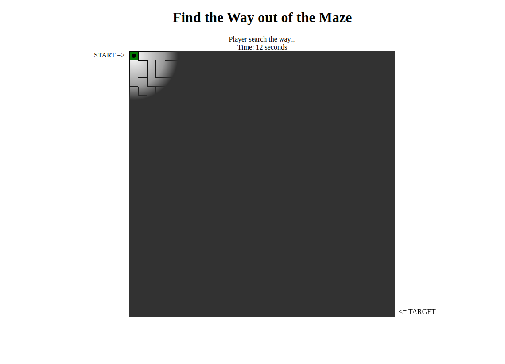

# Maze Game

A simple maze game where the player navigates through a randomly generated maze using keyboard controls. The game features a dynamic fog effect that limits visibility to a specific radius around the player, adding a challenge to finding the way out.

## Features

- Randomly generated maze.
- Dynamic fog effect that restricts visibility.
- Real-time timer to track progress.
- Victory condition with time display.
- Open-source and easy to modify.

## How to Play

1. Use the arrow keys to move the player (represented as a black dot).
2. Navigate through the maze to reach the red square, which is the endpoint.
3. The fog clears only around the player, making the pathfinding challenging.
4. Your time is displayed at the top of the page.

## Demo
## Demo
[Click here to try the demo](https://casparjones.github.io/maze/)




## Installation

1. Clone the repository:
   ```bash
   git clone https://github.com/casparjones/maze.git
   ```

2. Open the `index.html` file in your web browser.

3. Enjoy the game!

## Project Structure

- `index.html`: The main HTML file.
- `js/maze.js`: Handles maze generation.
- `js/player.js`: Controls player movement and fog rendering.
- `js/game.js`: Initializes the game.
- `style/game.css`: Optional styles (if needed).

## Credits

This project was developed with assistance from [ChatGPT](https://openai.com/chatgpt). The code was collaboratively refined to enhance gameplay and functionality.

## License

This project is licensed under the MIT License. Feel free to use, modify, and distribute the game.

---

Have fun navigating the maze and finding your way out!

